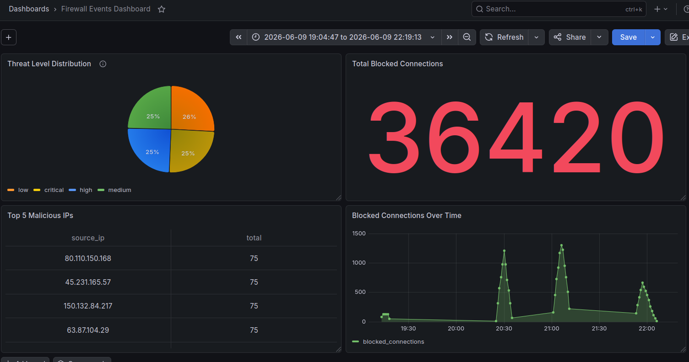
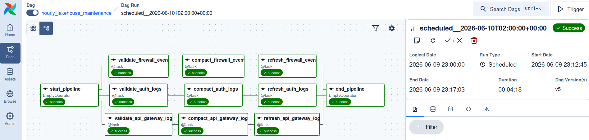
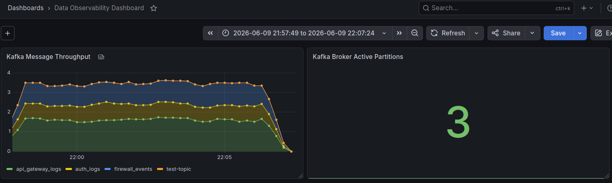
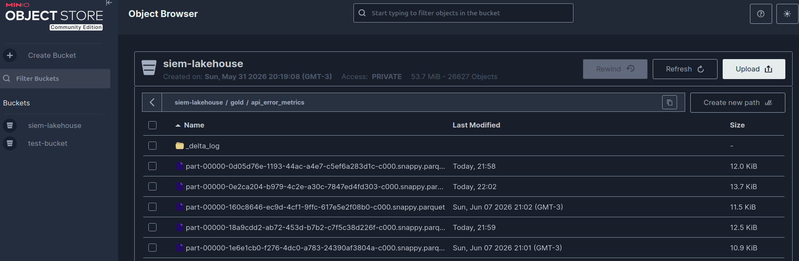
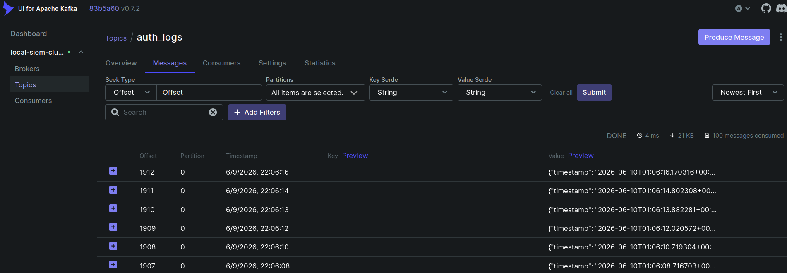

# Mini-SIEM Data Engineering Platform

A containerized data engineering pipeline simulating a Security Information and Event Management (SIEM) analytics platform. 

This project demonstrates the end-to-end lifecycle of high-throughput telemetry data, featuring real-time streaming, a Medallion Lakehouse architecture, automated orchestration, and a comprehensive observability layer.

## Architecture


## Technology Stack

* **Infrastructure & Containerization:** Docker Compose
* **Message Broker:** Apache Kafka (3-node KRaft cluster)
* **Stream Processing:** Apache Spark (Structured Streaming, PySpark)
* **Storage / Lakehouse:** MinIO (S3-compatible) & Delta Lake
* **Orchestration:** Apache Airflow (LocalExecutor)
* **Database:** PostgreSQL
* **Observability & Analytics:** Prometheus, Grafana

## Key Features

* **Robust Ingestion:** Python-based telemetry generators asynchronously feeding a partitioned, fault-tolerant Kafka cluster.
* **Medallion Lakehouse:** * **Bronze:** Immutable raw JSON ingestion.
  * **Silver:** Strongly typed, parsed, and flattened schemas.
  * **Gold:** Real-time sliding window aggregations detecting brute-force attack vectors.
* **Automated Maintenance:** Airflow DAGs executing Delta Lake `OPTIMIZE` and `VACUUM` commands to solve the small-file problem and manage data retention.
* **Idempotent Reporting:** Daily batch extractions from the Gold layer, inserted cleanly into Postgres via `ON CONFLICT` constraints.
* **Observability:** Complete metrics scraping via Prometheus, utilizing a Pushgateway for ephemeral Spark batch jobs and Kafka Exporter for consumer lag monitoring.

## Project Showcase

### 1. Real-Time SOC Analytics (Serving Layer)
*Data streamed continuously from Spark into PostgreSQL for sub-second Grafana rendering.*


### 2. Pipeline Orchestration & Maintenance
*Airflow managing Delta Lake compaction on an hourly DAG.*


### 3. Data Engineering Observability
*Prometheus scraping Kafka Exporter to monitor Kafka health.*


### 4. The Medallion Lakehouse 
*S3-Compatible object storage (MinIO) holding optimized Gold Delta/Parquet files.*


### 5. The Streaming Ingestion
*Kafka cluster consuming authentication messages.*


## Quick Start Setup

**1. Clone the repository and configure the environment**
```bash
git clone https://github.com/Gabryelx7/mini-SIEM.git
cd mini-SIEM
```

OPTIONAL: Create a `.env` file in the root directory with all desired credentials.
`docker-compose.yml` has a default value for each variable, so you can also just launch as is.


**2. Build and launch the infrastructure**
```Bash
docker compose build
docker compose up -d
```

**5. Access the Interfaces**

- **Kafka UI**: http://localhost:8080
- **MinIO Object Storage**: http://localhost:9001
- **Airflow**: http://localhost:8000 (check logs of airflow-apiserver for credentials)
- **Grafana Dashboards**: http://localhost:3000
- **Prometheus**: http://localhost:9090